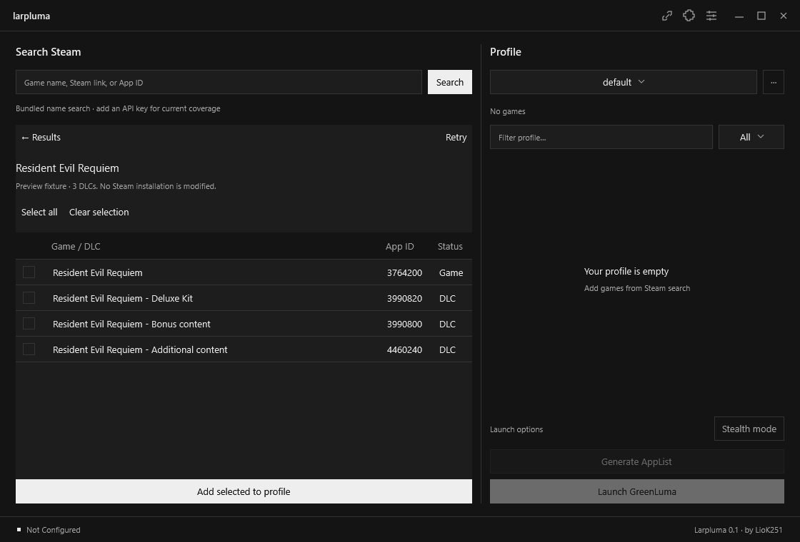

# Larpluma

A Windows fork of [GreenLuma Manager](https://github.com/3vil3vo/GreenLuma-Manager) by **LioK251**, with a new minimal monochrome WPF interface inspired by lazysync. Dark is the default; a white preset is included.

Repository: [LioK251/larpluma](https://github.com/LioK251/larpluma). Download the Windows executable from [Releases](https://github.com/LioK251/larpluma/releases). The square monochrome **L** icon is defined in [Assets/icon.svg](Assets/icon.svg); regenerate `icon.ico` with `powershell -NoProfile -STA -File scripts/build-icon.ps1` after editing it.



## Run

Open `dist/Larpluma.exe` on Windows 10 version 1809 or newer (x64). The packaged executable includes .NET 10. Configure Steam and GreenLuma paths in **Settings → General**. GreenLuma itself is not bundled.

The original profile tools, AppList import/generation, game renaming and ordering, stealth and launch options, deployment modes, GreenLuma update tools, startup options, and plugin interface are retained. General, System, and Advanced settings remain available; Appearance is a fourth page. Upstream Manager releases are notifications only: they cannot replace Larpluma's executable.

## Steam search

- Paste an App ID, for example `3764200`, or a Store link such as `https://store.steampowered.com/app/3764200/Resident_Evil_Requiem/`.
- Alternatively, search by name. Selecting a result opens the game and its DLC list. Select the base game and/or individual DLCs, then choose **Add selected to profile**. Nothing is added merely by searching or opening a game.
- Name search uses the bundled upstream catalog without an API key. Add a Steam Web API key in General settings for current catalog coverage. Link/App ID lookup and DLC discovery do not require this key.
- DLC lookup combines Steam product information and the Store API, deduplicates IDs, and resolves all returned DLCs without the old 20-result limit. A DLC link follows its parent game when Steam supplies that relationship.
- Unavailable sources or unresolved names produce a partial-result message and a Retry action. A lookup failure is not reported as “no DLC.” Unresolved App IDs require an explicit confirmation before being added. Steam can only return DLCs exposed by its APIs.

Search filters, per-row Add, bulk Add/Undo, and the profile filter remain available. Keyboard shortcuts: **Ctrl+F** search, **Ctrl+G** generate, **Ctrl+L** launch, **Ctrl+S** stealth, **Ctrl+Tab** next profile.

## Appearance

The interface uses square corners throughout, compact typography, and a shared 44-pixel custom title bar. Drag its free area to move the window; double-click to maximize/restore, or right-click for the Windows system menu. Resize from the edges. Resizable windows have a maximize/restore button; the main window also has minimize. Maximized bounds respect each monitor's taskbar. Windows 11 rounding is disabled.

Open **Settings → Appearance** to edit colors, font, interface scale (85–150%), density, and surface opacity. Changes preview immediately. Save appearance to persist them or Discard to restore the saved theme. Old theme files remain compatible; their `Radius` value is ignored and exported as `0`.

Local backgrounds support PNG, JPEG, BMP, GIF, MP4, and WebM, up to 256 MiB per file. Set fit, opacity, blur, and the monochrome overlay. Animated backgrounds loop silently and support pause and reduced motion. Minimized windows suspend playback. GIF reduced motion uses a still frame; videos use a captured still frame.

GIF/video playback needs the **Microsoft Edge WebView2 Runtime** (already present on most Windows installations). A missing runtime or unsupported codec produces an inline error and leaves the normal solid background usable. H.264 MP4 and VP9 WebM were verified. Media files stay local.

Import/export `.larptheme` archives to share a theme with its background. Imported archives validate colors, ranges, and embedded paths. Local backgrounds are copied into Larpluma's data directory so the original files can be moved later.

## Data and migration

Settings, profiles, plugins, icon cache, backgrounds, and browser data are stored under `%LOCALAPPDATA%\Larpluma`. On the first run, Larpluma offers a one-time import of settings and profiles from `%LOCALAPPDATA%\GLM_Manager`. It leaves the original files intact, refreshes icon paths, and disables imported startup and Manager auto-update preferences. Plugins are installed explicitly through the Plugins dialog.

The executable is named `Larpluma.exe`; the managed assembly name and `GreenLuma_Manager.Plugins.IPlugin` contract remain unchanged for upstream plugin compatibility. Plugins still need to be compatible with .NET 10 and their own dependencies.

## Build and check

Install the .NET 10 SDK, then run from the project directory:

```powershell
./scripts/build.ps1 -Check
```

This runs isolated regression checks and publishes the self-contained x64 single-file app to `dist/Larpluma.exe`. It uses `.tools/dotnet/dotnet.exe` if a local SDK is present; otherwise it uses `dotnet` from PATH. NuGet packages are stored in `.tools/packages`.

Run the checks alone:

```powershell
dotnet run --project Checks/Larpluma.Checks.csproj -- --output=artifacts/checks
dotnet run --project Checks/Larpluma.Checks.csproj -- --live --output=artifacts/live
```

Checks create isolated data under the output directory, render WPF screenshots, and cover input parsing, offline catalog search, cancellation, DLC selection/undo, profile ordering/rename, both AppList formats, plugin loading, themes, and migration. `--live` verifies the example game against Steam. `--media` additionally expects small local fixtures at `artifacts/media/background.gif`, `.mp4`, and `.webm`, and tests animation, pause/resume, reduced motion, and minimize/restore.

For an isolated visual preview without launching Steam or deploying files:

```powershell
$env:LARPLUMA_DATA_DIR = Join-Path $PWD 'artifacts/preview-data'
./dist/Larpluma.exe --preview
```

Preview results are clearly marked fixtures. Automated checks generate AppList files only in their isolated artifact directory. Real Steam launch and GreenLuma deployment require validation with a configured installation.

## Attribution

Based on upstream commit `f2530f469a61dac88500462f5f73fb28fe00e40b` by **3vil3vo**. Original documentation is retained in [README.upstream.md](README.upstream.md). Licensed under [GNU AGPL-3.0](LICENSE); upstream attribution and license are preserved. This project has no automatic upstream-binary installer.
